# System Architecture Diagrams

## 📊 High-Level System Flow

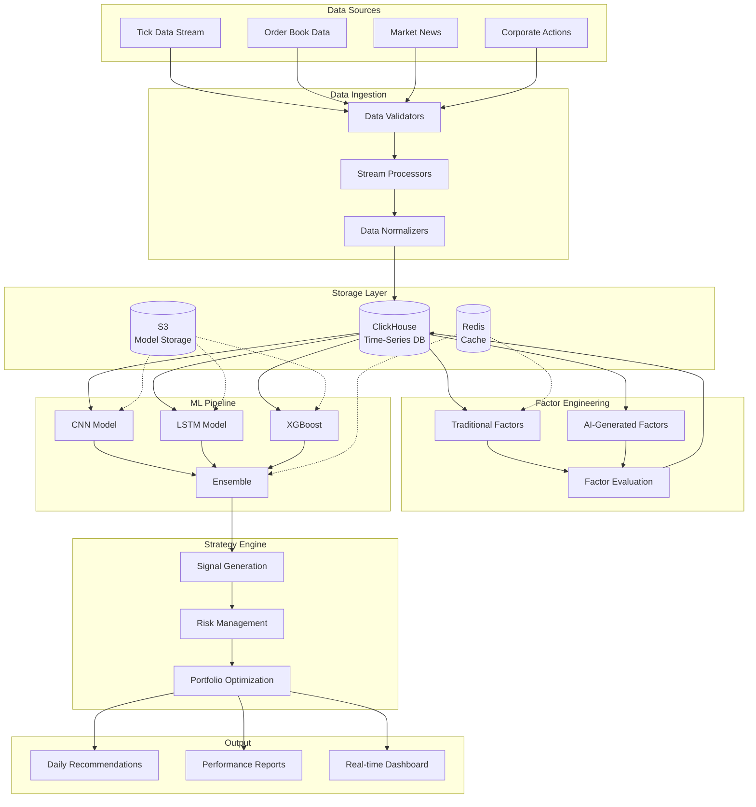

## 🔄 Data Processing Pipeline

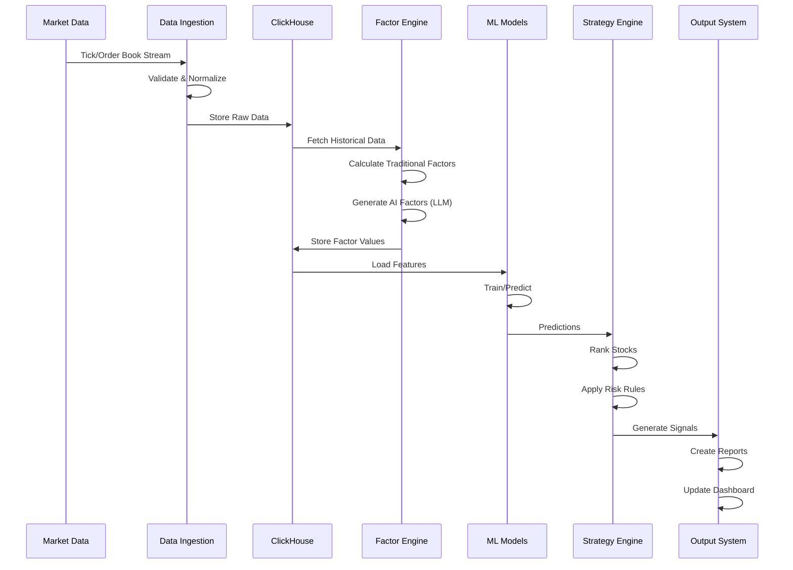

## 🧠 Machine Learning Architecture

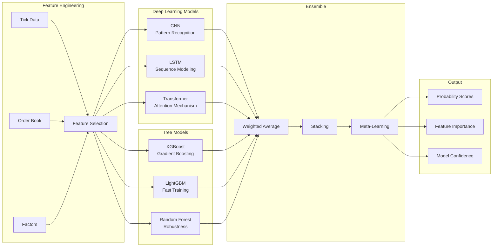

## 📈 Factor Generation Process

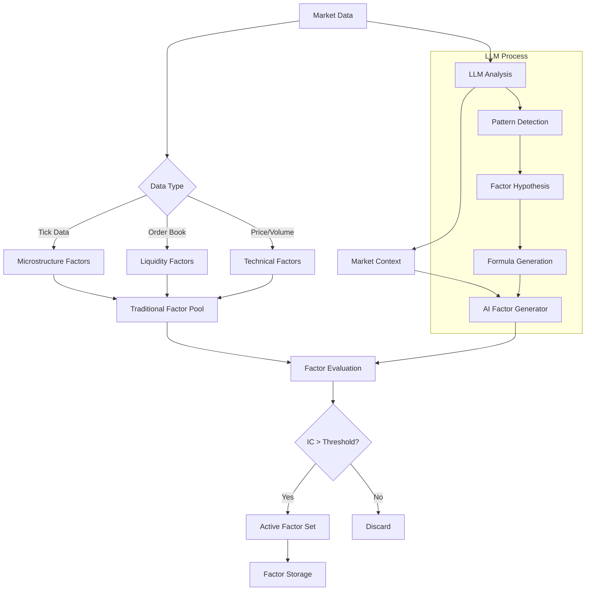

## 🎯 Strategy Execution Flow

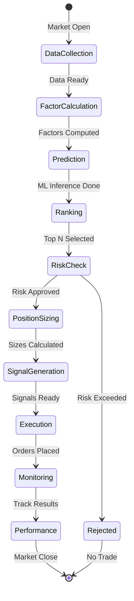

## 🏗️ Infrastructure Components

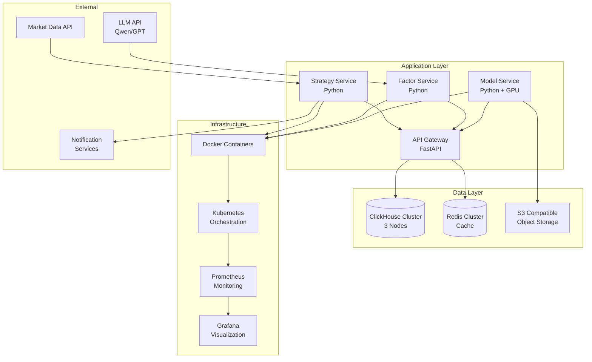

## 🔐 Security Architecture

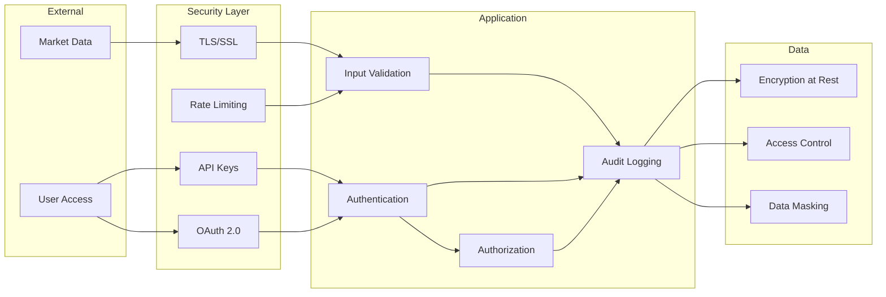

## 📊 Performance Monitoring

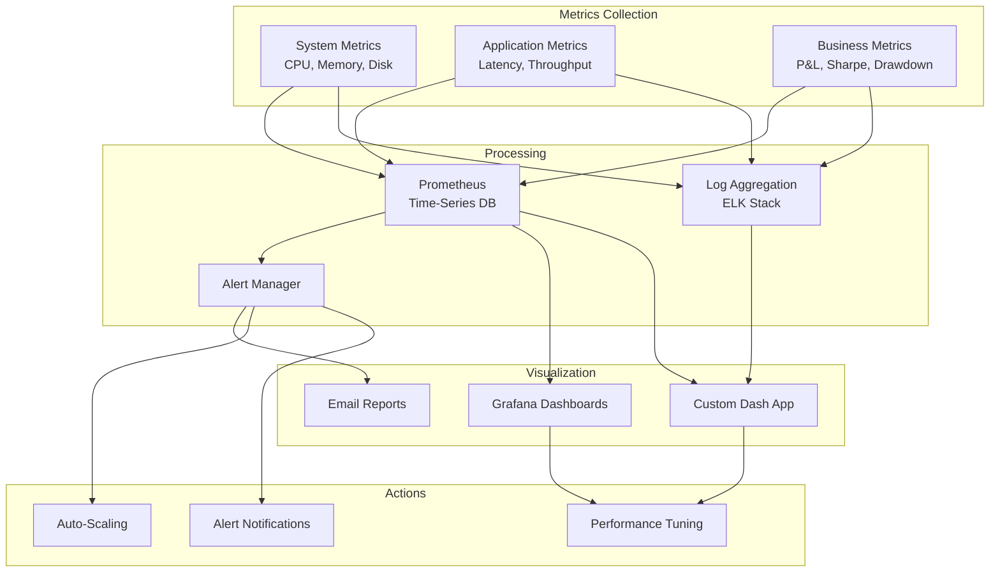

## 🔄 Backup and Recovery Flow

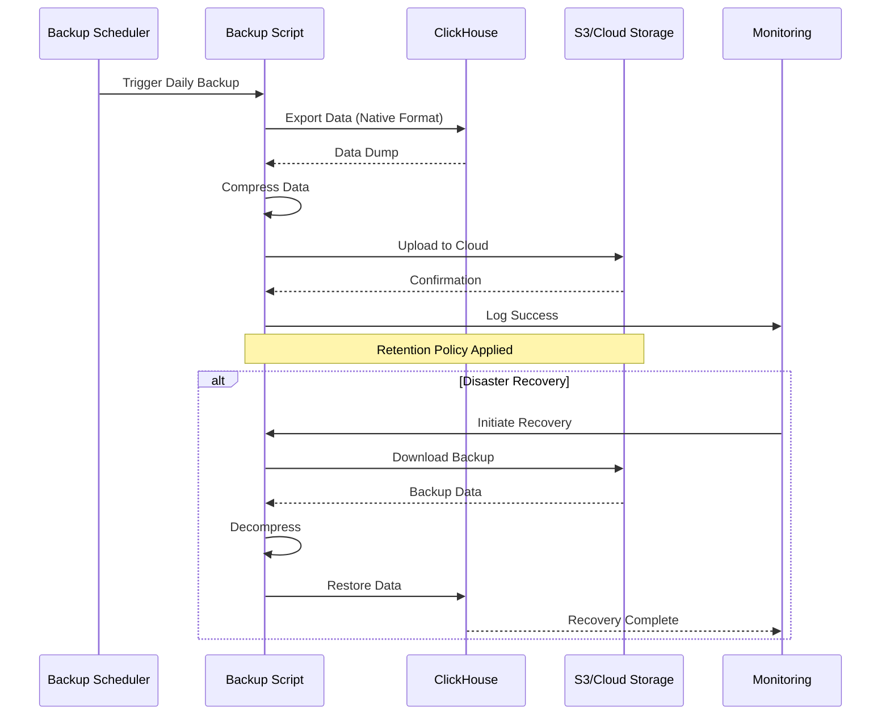

## 🚀 Deployment Pipeline

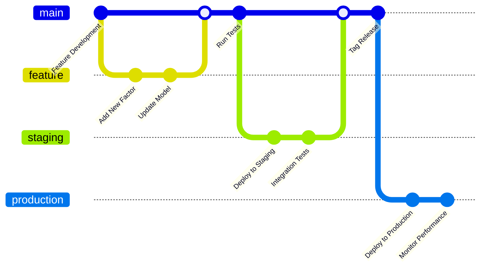

## 📈 Daily Strategy Workflow

```mermaid
gantt
    title Daily Strategy Execution Timeline
    dateFormat HH:mm
    axisFormat %H:%M
    
    section Pre-Market
    Data Preparation     :08:00, 30m
    Factor Calculation   :08:30, 30m
    Model Inference      :09:00, 20m
    Signal Generation    :09:20, 10m
    
    section Trading Hours
    Market Open          :milestone, 09:30, 0m
    Position Entry       :09:30, 30m
    Real-time Monitoring :10:00, 5h
    
    section Post-Market
    Market Close         :milestone, 15:00, 0m
    Performance Analysis :15:00, 30m
    Report Generation    :15:30, 30m
    Model Retraining     :16:00, 2h
```

## 🎯 System Integration Points

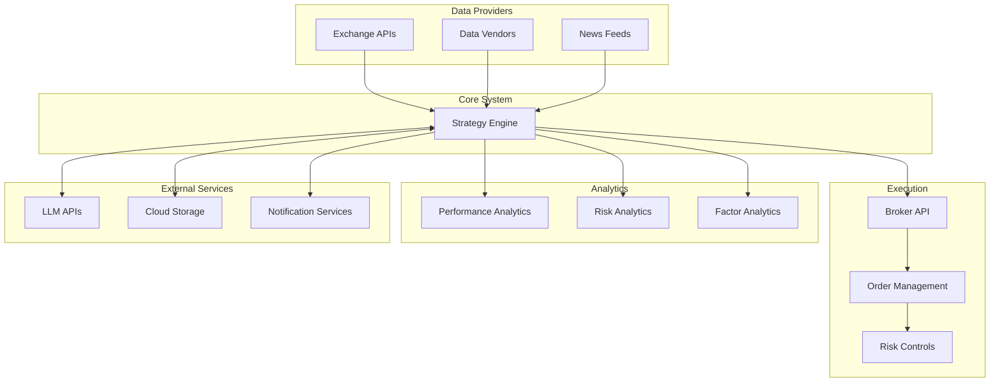

These diagrams provide a comprehensive visual representation of the system architecture, data flows, and operational processes. They can be rendered using any Mermaid-compatible viewer or documentation system.