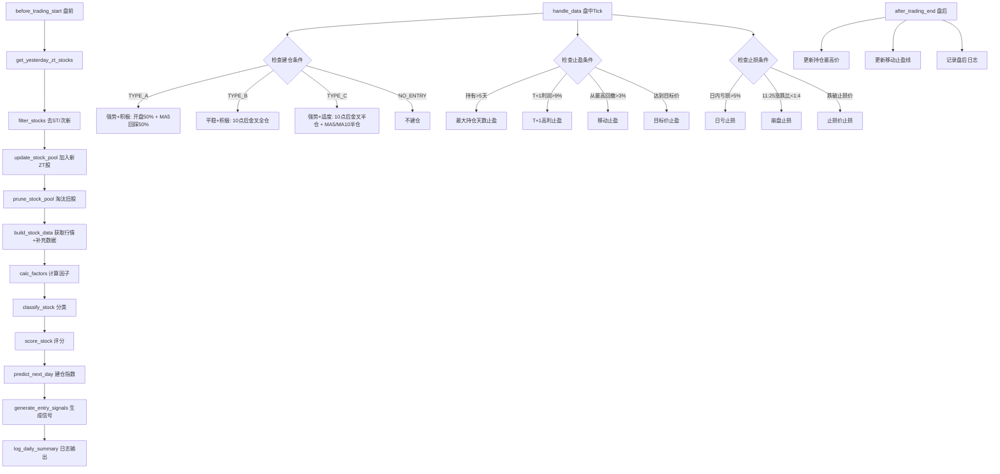
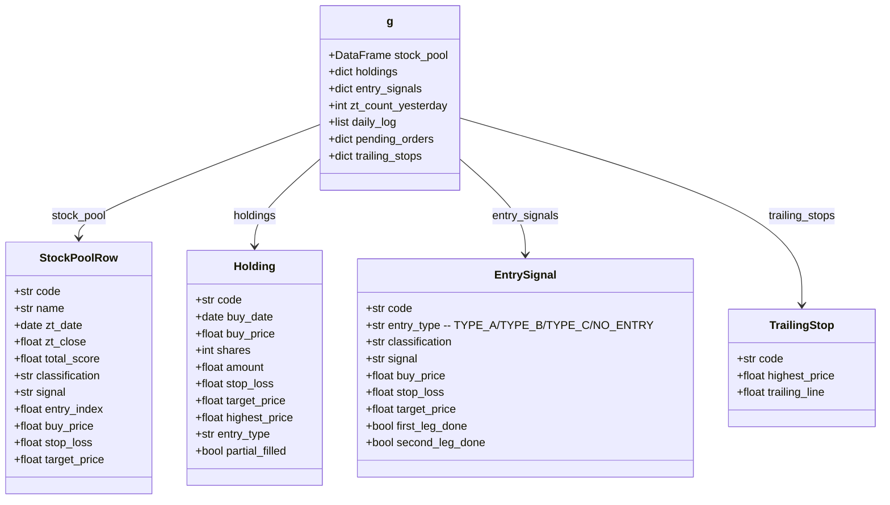
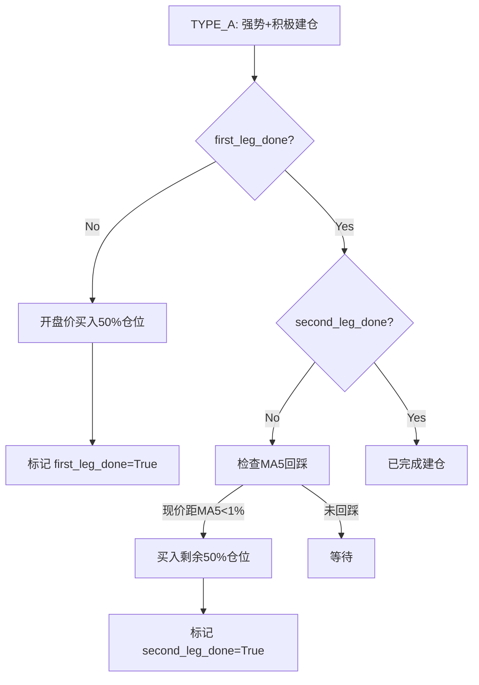
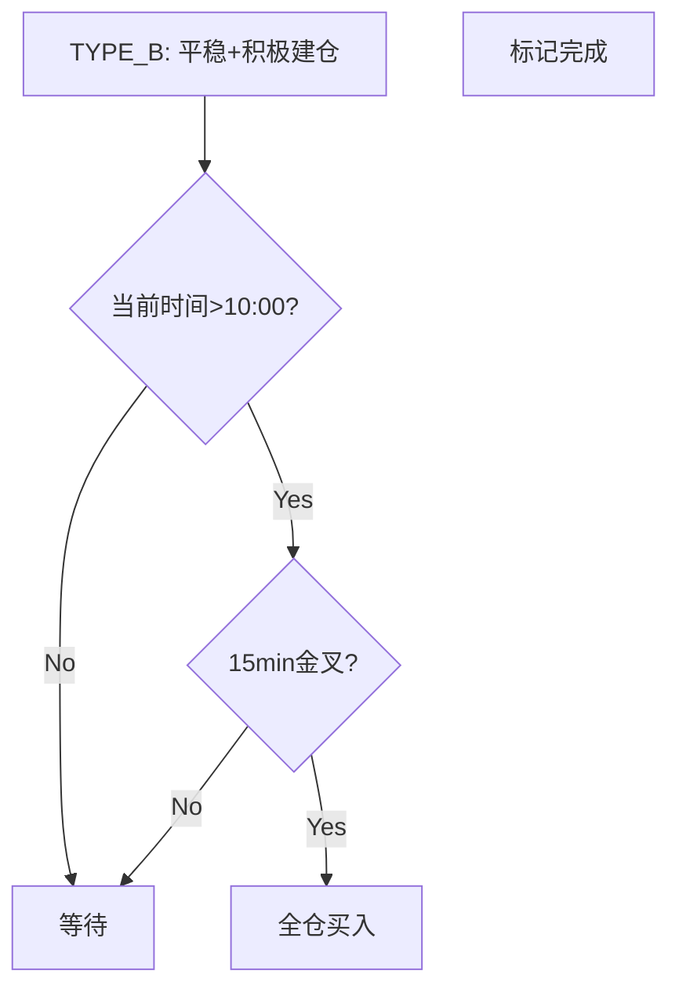
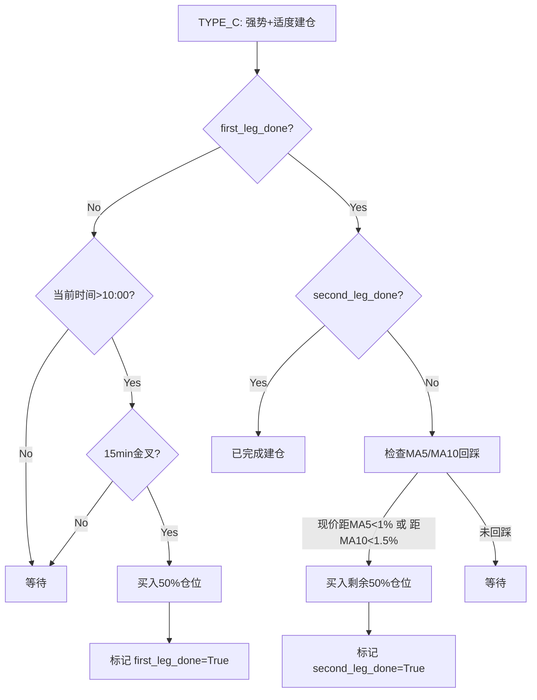
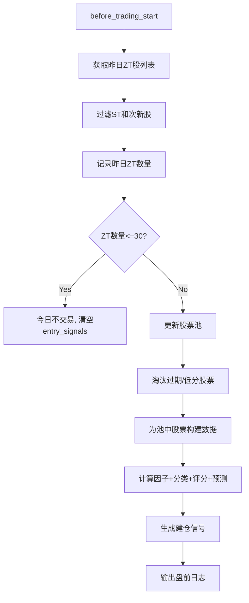
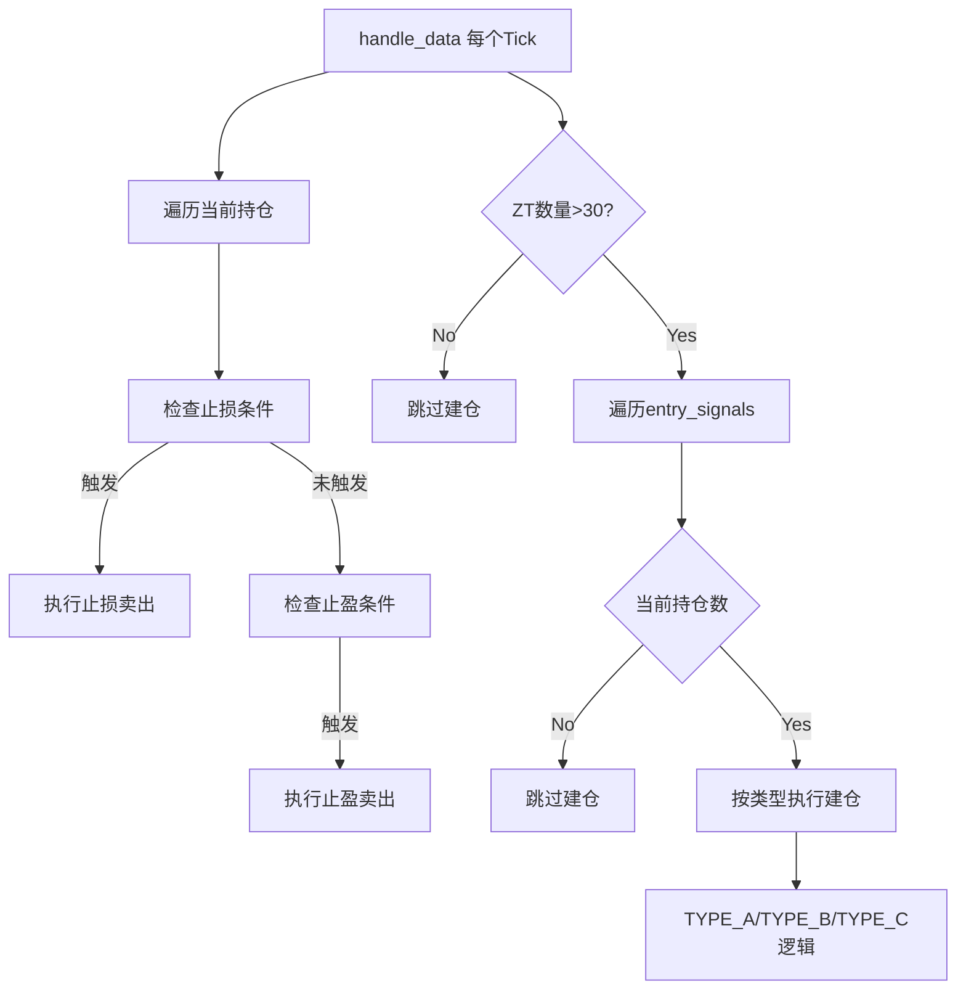
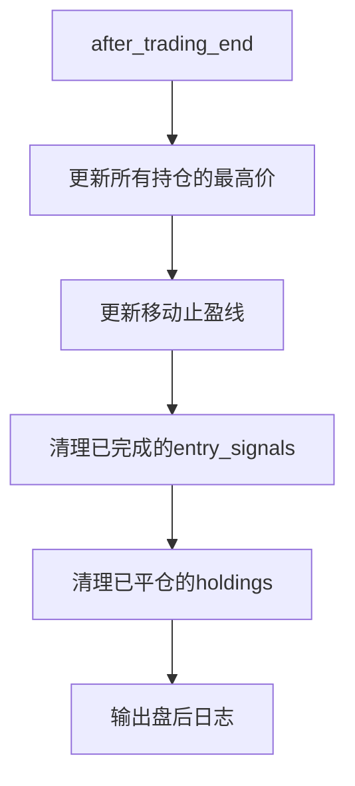

# zt_strategy.py 架构设计

## 1. 概述

基于 `zt_analysis.py` 的分析能力，构建 JoinQuant 交易策略，支持回测和实盘。策略核心逻辑：每日盘前获取昨日涨停股 → 更新股票池 → 运行分析管线 → 生成建仓信号 → 盘中按规则执行建仓/止盈/止损。

---

## 2. 整体数据流



---

## 3. 模块结构

`zt_strategy.py` 为单文件策略，按以下顺序组织代码：

```
Section 1: 环境导入
Section 2: 策略配置 STRATEGY_CONFIG
Section 3: 工具函数 (从 zt_analysis.py 复用)
Section 4: 涨停股筛选与过滤
Section 5: 股票池管理
Section 6: 数据获取与因子计算 (复用 zt_analysis.py 核心函数)
Section 7: 评分分类预测 (复用 zt_analysis.py)
Section 8: 建仓信号生成
Section 9: 技术指标 (MACD/KDJ/金叉)
Section 10: 建仓执行逻辑
Section 11: 止盈逻辑
Section 12: 止损逻辑
Section 13: 日志输出
Section 14: JQ策略框架 (initialize/before_trading_start/handle_data/after_trading_end)
```

---

## 4. 策略配置 STRATEGY_CONFIG

```python
STRATEGY_CONFIG = {
    # --- 股票池 ---
    'pool_max_size': 100,           # 股票池最大容量
    'pool_zt_expire_days': 10,      # ZT日超过此天数则淘汰
    'min_list_days': 63,            # 上市不足此天数则过滤 (约3个月)

    # --- 建仓 ---
    'max_entry_count': 5,           # 每日最大建仓数
    'max_holdings': 5,              # 最大同时持仓数
    'zt_count_threshold': 30,       # 昨日ZT数<=此值则不交易

    # --- 止盈 ---
    'max_hold_days': 5,             # 最大持仓天数
    't1_profit_take_pct': 0.09,     # T+1利润>9%止盈
    'trailing_stop_pct': 0.03,      # 从最高价回撤3%移动止盈

    # --- 止损 ---
    'daily_stop_loss_pct': 0.05,    # 日内亏损>5%止损
    'crash_ratio': 4,               # 涨跌比 < 1:4 判定崩盘
    'crash_check_time': '11:25',    # 崩盘检测时间

    # --- 技术指标 ---
    'macd_fast': 12,
    'macd_slow': 26,
    'macd_signal': 9,
    'kdj_n': 9,
    'kdj_m1': 3,
    'kdj_m2': 3,
    'ma5_bias_threshold': 0.01,     # MA5回踩阈值: 距MA5<1%视为回踩
    'ma10_bias_threshold': 0.015,   # MA10回踩阈值

    # --- 评分 (与 zt_analysis.py CONFIG 一致) ---
    'score_weights': {
        'price_strength': 30,
        'trend_structure': 20,
        'volume': 20,
        'capital_flow': 15,
        'fundamental': 10,
        'risk_deduction': 5,
    },
    'defense_line': -0.03,
    'zt_threshold': 9.8,
}
```

---

## 5. 状态管理 (通过 JQ g 对象)



---

## 6. 核心函数设计

### 6.1 涨停股筛选

| 函数 | 说明 |
|------|------|
| `get_yesterday_zt_stocks(context)` | 调用 JQ API 获取昨日涨停股列表 |
| `filter_stocks(context, stock_list)` | 过滤ST股、上市不足3个月股 |

**ZT识别逻辑**: 获取昨日全A股票日K，筛选 `pct_change >= zt_threshold` 的股票。

**JQ API调用**:
- `get_all_securities('stock')` 获取全A列表
- `get_price(stocks, end_date=yesterday, count=1, frequency='daily', fields=['close','pct_change'])` 批量获取涨跌幅
- `get_extras('is_st', stocks, end_date=yesterday)` 判断ST
- `get_security_info(code).start_date` 判断上市日期

### 6.2 股票池管理

| 函数 | 说明 |
|------|------|
| `update_stock_pool(context, new_zt_df)` | 将新ZT股加入池中，去重 |
| `prune_stock_pool(context)` | 按规则淘汰: 最低分/不建议建仓/ZT日过期 |

**淘汰优先级**:
1. 信号为"不建议建仓"的股票
2. ZT日期超过 `pool_zt_expire_days` 天的股票
3. 总评分最低的股票 (直到池大小 <= `pool_max_size`)

### 6.3 数据获取与因子计算

| 函数 | 说明 | 来源 |
|------|------|------|
| `build_stock_data(context, stock_codes)` | 为池中股票获取行情+补充数据 | 新写 |
| `calc_factors(price_df)` | 计算26个因子 | 复用 zt_analysis.py |
| `classify_stock(factor_df)` | 强势/平稳/弱势分类 | 复用 zt_analysis.py |
| `score_stock(factor_df)` | 0-100评分 | 复用 zt_analysis.py |
| `predict_next_day(scored_df)` | 建仓指数+买卖价 | 复用 zt_analysis.py |

**`build_stock_data` 逻辑**:
1. 对池中每只股票，以 `zt_date` 为基准日，调用 `get_price()` 获取ZT日后N天行情
2. 调用 `supplement_jq_data()` 补充资金流/基本面数据
3. 返回与 `zt_analysis.py` 中 `get_price_data()` + `supplement_jq_data()` 相同格式的 DataFrame

### 6.4 建仓信号生成

| 函数 | 说明 |
|------|------|
| `generate_entry_signals(context, predict_df)` | 根据分类+信号生成4类建仓信号 |

**信号映射规则**:

| 分类 | 信号 | 建仓类型 | 说明 |
|------|------|----------|------|
| 强势 | 积极建仓 | TYPE_A | 开盘50% + MA5回踩50% |
| 平稳 | 积极建仓 | TYPE_B | 10点后15min金叉全仓 |
| 强势 | 适度建仓 | TYPE_C | 10点后15min金叉半仓 + MA5/MA10半仓 |
| 其他 | 任意 | NO_ENTRY | 不建仓 |

**选股逻辑**: 从有建仓信号的股票中，按 `entry_index` 降序取前 `max_entry_count` 只。

### 6.5 技术指标

| 函数 | 说明 |
|------|------|
| `calc_macd(close_series, fast, slow, signal_period)` | 计算MACD: DIF/DEA/MACD柱 |
| `calc_kdj(high_series, low_series, close_series, n, m1, m2)` | 计算KDJ: K/D/J值 |
| `check_15min_golden_cross(context, stock_code)` | 检查15分钟MACD/KDJ金叉 |

**金叉判定**: MACD柱由负转正 且 K线上穿D线 (两个条件同时满足)。

**15分钟数据获取**: `get_bars(stock_code, count=50, frequency='15m', fields=['close','high','low'])`

### 6.6 建仓执行逻辑

| 函数 | 说明 |
|------|------|
| `execute_entry(context, data)` | 盘中建仓主入口，遍历entry_signals执行 |
| `execute_type_a(context, data, code, signal)` | 强势+积极建仓 |
| `execute_type_b(context, data, code, signal)` | 平稳+积极建仓 |
| `execute_type_c(context, data, code, signal)` | 强势+适度建仓 |
| `check_ma5_dip(context, data, code)` | 检查MA5回踩条件 |
| `check_ma10_dip(context, data, code)` | 检查MA10回踩条件 |

**TYPE_A 执行流程**:


**TYPE_B 执行流程**:


**TYPE_C 执行流程**:


**仓位计算**:
- 单股分配金额 = `context.portfolio.total_value / max_holdings`
- TYPE_A 第一腿 = 分配金额 * 50%, 第二腿 = 分配金额 * 50%
- TYPE_B 全仓 = 分配金额 * 100%
- TYPE_C 第一腿 = 分配金额 * 50%, 第二腿 = 分配金额 * 50%
- 买入股数 = 金额 / 当前价格，取整到100股

### 6.7 止盈逻辑

| 函数 | 说明 |
|------|------|
| `check_take_profit(context, data)` | 检查所有持仓的止盈条件 |
| `check_max_hold_days(context, code, holding)` | 持仓超过max_hold_days |
| `check_t1_profit(context, code, holding)` | T+1利润>9% |
| `check_trailing_stop(context, code, holding)` | 从最高价回撤>3% |
| `check_target_price(context, code, holding)` | 达到目标价 |

**止盈优先级**: 任一条件满足即触发，按以下顺序检查:
1. T+1利润 > 9% (最优先锁定高利润)
2. 目标价达到
3. 移动止盈 (从最高价回撤 > 3%)
4. 最大持仓天数 (最后兜底)

**移动止盈细节**:
- 每日盘后更新 `highest_price` = max(历史最高, 当日最高)
- `trailing_line` = `highest_price * (1 - trailing_stop_pct)`
- 当前价 < `trailing_line` 时触发止盈

### 6.8 止损逻辑

| 函数 | 说明 |
|------|------|
| `check_stop_loss(context, data)` | 检查所有持仓的止损条件 |
| `check_daily_loss(context, code, holding)` | 日内亏损>5% |
| `check_market_crash(context)` | 涨跌比<1:4崩盘检测 |
| `check_stop_loss_price(context, code, holding)` | 跌破止损价 |

**止损优先级**: 任一条件满足即触发，按以下顺序检查:
1. 跌破止损价 (最危险，优先处理)
2. 日内亏损 > 5%
3. 崩盘检测 (11:25检查)

**崩盘检测逻辑**:
- 11:25 获取全A股票涨跌情况
- 统计上涨家数和下跌家数
- 如果 上涨家数/下跌家数 < 1/4，判定崩盘，清仓所有持仓

### 6.9 日志输出

| 函数 | 说明 |
|------|------|
| `log_daily_summary(context)` | 每日盘后输出完整日志 |

**日志内容**:
1. 股票池大小和ZT股数量
2. Top 10 评分股票 (含因子数据)
3. 昨日涨停股数量
4. 当前持仓信息 (买入日期、盈亏、股数、金额、总盈亏)
5. 今日建仓建议 (分类+信号+建仓类型)

---

## 7. JQ策略框架

### 7.1 initialize(context)

```python
def initialize(context):
    # 设置策略参数
    set_option('use_real_price', True)          # 使用真实价格交易
    set_option('order_volume_ratio', 1)          # 无成交量限制
    set_commission(PerTrade(buy_cost=0.0003, sell_cost=0.0013, min_cost=5))  # 佣金
    set_slippage(FixedSlippage(0.02))            # 滑点

    # 初始化全局状态
    g.stock_pool = pd.DataFrame()                # 股票池
    g.holdings = {}                              # 持仓 dict
    g.entry_signals = {}                         # 当日建仓信号
    g.zt_count_yesterday = 0                     # 昨日ZT数
    g.daily_log = []                             # 日志
    g.trailing_stops = {}                        # 移动止盈线
    g.pending_orders = {}                        # 待执行订单

    # 运行时间
    run_daily(before_trading_start, time='08:30')
    run_daily(after_trading_end, time='15:10')
```

### 7.2 before_trading_start(context)



### 7.3 handle_data(context, data)



### 7.4 after_trading_end(context)



---

## 8. 从 zt_analysis.py 复用的函数

以下函数直接从 `zt_analysis.py` 复制并适配到策略环境:

| 函数 | 行号 | 适配说明 |
|------|------|----------|
| `_safe_series()` | 455-476 | 直接复用 |
| `_safe_get()` | 479-489 | 直接复用 |
| `_dedup_columns()` | 492-497 | 直接复用 |
| `_normalize_jq_code()` | 500-526 | 直接复用 |
| `calc_factors()` | 1305-1398 | 直接复用 |
| `classify_stock()` | 1515-1614 | 直接复用，CONFIG改为STRATEGY_CONFIG |
| `score_stock()` | 1622-1910 | 直接复用，CONFIG改为STRATEGY_CONFIG |
| `predict_next_day()` | 1921-2116 | 直接复用，CONFIG改为STRATEGY_CONFIG |

**不适用的函数** (需要新写替代):
- `read_data()` → 替换为 `get_yesterday_zt_stocks()`
- `clean_data()` → 替换为 `filter_stocks()`
- `get_price_data()` → 替换为 `build_stock_data()`
- `supplement_jq_data()` → 集成到 `build_stock_data()`
- `output_results()` → 替换为 `log_daily_summary()`

---

## 9. 关键实现细节

### 9.1 ZT股识别

```python
def get_yesterday_zt_stocks(context):
    yesterday = context.previous_date
    all_stocks = get_all_securities('stock', date=yesterday)
    # 批量获取涨跌幅
    prices = get_price(all_stocks.index.tolist(), end_date=yesterday,
                       count=1, frequency='daily', fields=['close','pct_change'])
    # 筛选涨停 (涨幅 >= zt_threshold)
    zt_stocks = prices[prices['pct_change'] >= STRATEGY_CONFIG['zt_threshold']]
    return zt_stocks
```

### 9.2 15分钟金叉检测

```python
def check_15min_golden_cross(context, stock_code):
    bars = get_bars(stock_code, count=50, frequency='15m',
                    fields=['close','high','low','datetime'])
    close = bars['close']
    high = bars['high']
    low = bars['low']

    # 计算MACD
    dif, dea, macd_hist = calc_macd(close)

    # 计算KDJ
    k, d, j = calc_kdj(high, low, close)

    # 金叉条件: MACD柱由负转正 且 K上穿D
    macd_cross = macd_hist.iloc[-1] > 0 and macd_hist.iloc[-2] <= 0
    kd_cross = k.iloc[-1] > d.iloc[-1] and k.iloc[-2] <= d.iloc[-2]

    # 宽松条件: MACD柱为正 且 K>D (不要求精确交叉点)
    macd_positive = macd_hist.iloc[-1] > 0
    kd_golden = k.iloc[-1] > d.iloc[-1] and k.iloc[-1] < 80  # K<D超买区

    return macd_cross or (macd_positive and kd_cross) or (macd_positive and kd_golden)
```

### 9.3 MA5/MA10回踩检测

```python
def check_ma5_dip(context, stock_code):
    # 获取日K计算MA5
    prices = get_price(stock_code, end_date=context.current_dt.date(),
                       count=10, frequency='daily', fields=['close'])
    ma5 = prices['close'].rolling(5).mean().iloc[-1]
    current_price = get_current_data()[stock_code].last_price
    bias = (current_price - ma5) / ma5
    return abs(bias) < STRATEGY_CONFIG['ma5_bias_threshold']
```

### 9.4 崩盘检测

```python
def check_market_crash(context):
    current_time = context.current_dt.time()
    if current_time.hour != 11 or current_time.minute != 25:
        return False

    all_stocks = get_all_securities('stock', date=context.current_dt.date())
    prices = get_price(all_stocks.index.tolist(), end_date=context.current_dt.date(),
                       count=1, frequency='daily', fields=['pct_change'])
    advance = len(prices[prices['pct_change'] > 0])
    decline = len(prices[prices['pct_change'] < 0])

    if decline == 0:
        return False
    ratio = advance / decline
    return ratio < 1 / STRATEGY_CONFIG['crash_ratio']
```

### 9.5 仓位管理

```python
def calc_position_size(context, stock_code, ratio=1.0):
    """计算买入股数"""
    total_value = context.portfolio.total_value
    per_stock = total_value / STRATEGY_CONFIG['max_holdings']
    buy_amount = per_stock * ratio
    current_price = get_current_data()[stock_code].last_price
    shares = int(buy_amount / current_price / 100) * 100  # 取整到100股
    return max(shares, 100)  # 最少买100股
```

---

## 10. 错误处理与边界情况

| 场景 | 处理方式 |
|------|----------|
| 股票池为空 | 不执行任何操作，日志记录 |
| 无建仓信号 | 不建仓，日志记录 |
| 买入失败 (涨跌停/停牌) | 记录日志，不重试 |
| 数据获取失败 | try/except 包裹，跳过该股票 |
| 持仓股停牌 | 无法卖出，跳过止盈止损检查 |
| 多个止盈/止损同时触发 | 按优先级处理，先止损后止盈 |
| T+1限制 | 当日买入的股票当日不能卖出 (JQ自动处理) |
| 资金不足 | 减少买入股数或跳过 |

---

## 11. 实现步骤 (Todo List)

1. 创建 `zt_strategy.py` 文件骨架，包含环境导入和 STRATEGY_CONFIG
2. 复用工具函数: `_safe_series`, `_safe_get`, `_dedup_columns`, `_normalize_jq_code`
3. 实现 `get_yesterday_zt_stocks()` 和 `filter_stocks()`
4. 实现 `update_stock_pool()` 和 `prune_stock_pool()`
5. 实现 `build_stock_data()` (整合 get_price_data + supplement_jq_data 逻辑)
6. 复用 `calc_factors()`, `classify_stock()`, `score_stock()`, `predict_next_day()`
7. 实现 `generate_entry_signals()`
8. 实现 `calc_macd()`, `calc_kdj()`, `check_15min_golden_cross()`
9. 实现 `execute_entry()` 及 TYPE_A/B/C 三种建仓逻辑
10. 实现 `check_take_profit()` 及4种止盈条件
11. 实现 `check_stop_loss()` 及3种止损条件
12. 实现 `log_daily_summary()`
13. 实现 JQ 框架: `initialize()`, `before_trading_start()`, `handle_data()`, `after_trading_end()`
14. 语法验证和代码审查
